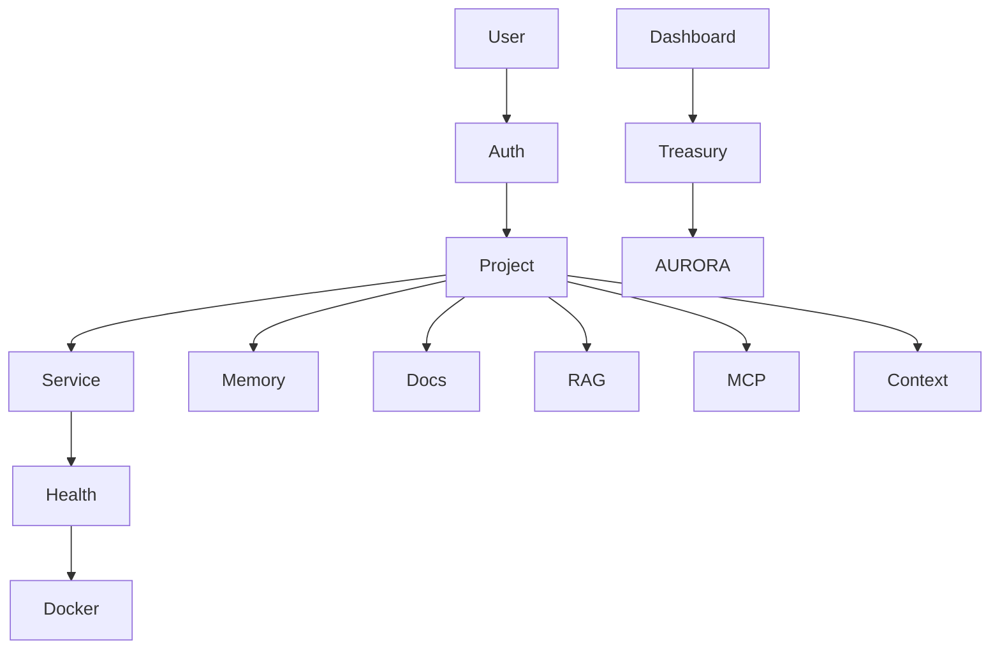

# AGENTS — forgeops

## Agents (10)

| # | Agent | File | Role |
|---|-------|------|------|
| 1 | Project Agent | lib/api/projects.ts | CRUD projects |
| 2 | Service Agent | lib/api/services.ts | Docker services control |
| 3 | Memory Agent | lib/api/memory.ts | Architecture decisions |
| 4 | Docs Agent | lib/api/docs.ts | Documentation management |
| 5 | RAG Agent | lib/api/rag.ts | Retrieval augmented generation |
| 6 | Health Agent | lib/api/health.ts | Health checks + Docker connection |
| 7 | Treasury Agent | app/api/dashboard/treasury/route.ts | AURORA balances + sweeps |
| 8 | Auth Agent | lib/auth.ts | NextAuth + RBAC |
| 9 | MCP Agent | lib/api/mcp.ts | Model Context Protocol |
| 10 | Context Agent | lib/api/context.ts | File tree + analysis |

## Flow



## How to Extend

- Add new tab: create component in components/projects/detail/tabs/ + API in lib/api/ + test in tests/
- Add new permission: edit lib/permissions.ts + test in permissions.test.ts
- Add new service: edit prisma/schema.prisma + seed.ts + API

## Testing

```bash
npm test
# 47 passed
```

## Env

See .env.example — DATABASE_URL, NEXTAUTH_SECRET, ENCRYPTION_KEY, AURORA_API_URL optional
