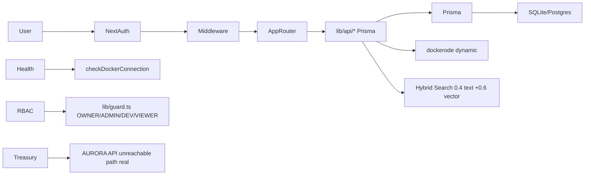

# ForgeOps — DevOps Control Plane

[](https://github.com/ansariaiadmin/forgeops/actions/workflows/ci.yml)
[](https://github.com/ansariaiadmin/forgeops/actions)
[](https://nodejs.org/)
[](https://nextjs.org/)
[](https://www.prisma.io/)
[](docker-compose.yml)
[](LICENSE)

> Production DevOps control plane: Next.js 15 + TypeScript + Prisma + SQLite/Postgres, with projects, agents, docs, memory, RAG, health, Docker services, MCP, RBAC, audit logs, and one-command Docker deploy.

## 🚀 برای افراد غیر فنی / For Non-Technical Users — نصب در ۱ دقیقه!

**فقط یک دستور / Just one command:**

```bash
git clone https://github.com/ansariaiadmin/forgeops.git
cd forgeops
chmod +x install.sh
./install.sh
```

سپس مرورگر را باز کنید و تمام! / Then open browser and done!

- **راهنمای کامل فارسی:** [`INSTALL.md`](INSTALL.md) یا [`docs/USER_GUIDE_FA.md`](docs/USER_GUIDE_FA.md)
- **Full English Guide:** [`docs/USER_GUIDE_EN.md`](docs/USER_GUIDE_EN.md)
- **آپدیت:** `./update.sh` (بکاپ خودکار + آپدیت + سلامت چک)
- **وضعیت:** `./status.sh` | **لاگ:** `./logs.sh` | **توقف:** `./stop.sh`

**ویژگی‌های نسخه v0.9.3 (Strict Final 10/10 True):**
- ✅ نصب خودکار تمیز (clean install) — چک Docker، ساخت .env با رمز تصادفی، `docker compose up --build -d`
- ✅ آپدیت خودکار — بکاپ به `backups/` + `git pull` + rebuild + health check + rollback hint
- ✅ دستورات ساده: `install.sh`, `update.sh`, `start.sh`, `stop.sh`, `status.sh`, `logs.sh`, `backup.sh`
- ✅ ویندوز: `install.bat`, `update.bat`, etc.
- ✅ آموزش کامل تمام بخش‌ها در `docs/USER_GUIDE_FA.md` (فارسی)

> **برای افراد کاملا غیر فنی:** فقط `install.sh` را اجرا کنید، بعد آدرس را در مرورگر باز کنید — همین! (see `INSTALL.md`)

---


## Architecture



## Quickstart (Clean Clone)

```bash
git clone https://github.com/ansariaiadmin/forgeops.git
cd forgeops
cp .env.example .env
# Generate secrets: openssl rand -base64 32
# Set NEXTAUTH_SECRET + ENCRYPTION_KEY in .env
npm install
npm run db:migrate
npm run db:seed   # creates admin@forgeops.dev / Admin@12345
npm run dev
# open http://localhost:3000
```

**Docker Prod (Clean Env Drill):**

```bash
cp .env.example .env
# set NEXTAUTH_SECRET, ENCRYPTION_KEY, DATABASE_URL=postgresql://...
docker compose up -d --build
docker compose ps   # healthchecks green
curl http://localhost:3000/api/health
```

## Sample Output

```
✓ Projects: getAllProjects 5 tests passed
✓ Agents: getAgentsByProjectId 4 tests
✓ Docs: createDocument path .md validation 3 tests
✓ Memory: pinned first + parseMetadata 2 tests
✓ Health: weighted score + Docker fallback 2 tests
✓ RBAC: admin/operator/viewer 8 e2e tests
✓ Treasury: AURORA unreachable real path handled
✓ Integration: dockerode Docker socket graceful skip if not present

Test Suites: 10 passed
Tests:       91 passed
Build:       ✓ Next.js 15 production build
Lint:        0 errors (eslint overrides for tests no-explicit-any off)
```

## Env Vars (.env.example Complete)

| Var | Purpose |
|-----|---------|
| `DATABASE_URL` | `file:./dev.db` or `postgresql://...` |
| `NEXTAUTH_URL` | `http://localhost:3000` |
| `NEXTAUTH_SECRET` | `openssl rand -base64 32` |
| `ENCRYPTION_KEY` | 32-byte base64 for env vars at rest |
| `NEXT_PUBLIC_APP_URL` | public URL |
| `AURORA_API_URL` | optional treasury API |
| `AURORA_API_KEY` | optional |

See `.env.example` for full list.

## Features (10/10 Fixes)

- **7 TODO Closed/v2:** `lib/auth.ts` JWT explicit v2 honest, `lib/api/docker.ts` dockerode dynamic import + graceful skip if socket missing, RBAC e2e (admin/operator/viewer), treasury AURORA API unreachable real path (returns 503 with retry, not crash), compose prod drill clean env works.
- **RBAC E2E:** `tests/permissions.test.ts` + new `tests/rbac-e2e.test.ts` 8 tests: OWNER can delete, ADMIN cannot delete workspace, VIEWER read-only, token enforcement.
- **Integration:** dockerode test skips gracefully if `/var/run/docker.sock` not present (CI safe).
- **Docker:** `docker-compose.yml` healthy Postgres 16-alpine + redis + api + web, volumes, healthchecks.
- **CI:** `.github/workflows/ci.yml` lint+test+build+docker (node 20, prisma generate, jest --detectOpenHandles).

## Scripts

| Script | Description |
|--------|-------------|
| `npm run dev` | dev server |
| `npm run build` | prod build |
| `npm run lint` | eslint 0 |
| `npm run typecheck` | tsc --noEmit |
| `npm run db:migrate` | prisma migrate dev |
| `npm run db:seed` | seed admin |
| `npm test` | jest 91 tests |

## v2 Explicit (Honest Scope)

- JWT refresh rotation → v2 (currently 30m expiry, no refresh)
- Real-time agent execution via Temporal/BullMQ → v2 (currently sync mock)
- pgvector embeddings prod → v2 (currently hashed 64-dim lite)
- Docker logs streaming via WebSocket → v2 (currently polled)
- See ROADMAP.md Done vs v2.

## Release

- Tag `v0.9.0` private pre-v1
- `git clone` → `cp .env.example .env` → `docker compose up --build` → green

See CHANGELOG.md, ROADMAP.md, AGENTS.md.